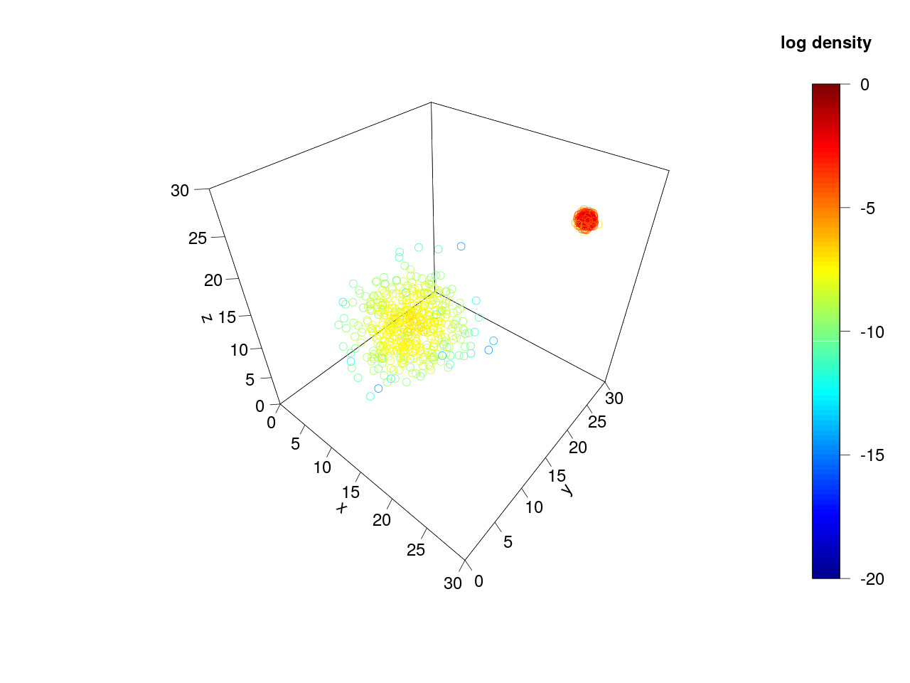

# Assessing MCMC convergence

## Introduction

Consider the following MCMC traces showing the log probability density from two
independent chains, both sampling from the same probability distribution:

Which chain has converged? It seems intuitive that the chain with the higher
log probability density has converged and is sampling from the stationary
distribution, whereas the chain with the lower posterior density has failed to
do so. After all, there is roughly 5.5 log units between the means of the two
chains, meaning that the probability density being sampled by the turquoise
chain is roughly 250 times greater than what is being sampled by the gold
chain!

However I will show that in fact neither chain has converged.

## Probability distribution parameters

In this case, we are sampling from a three-dimensional probability
distribution which is a 50/50 mixture of two circular-symmetric multivariate
Gaussians. The mean and standard deviation of each coordinate for the first
(broad) Gaussian are 12 and 3 respectively, and for the second (narrow)
Gaussian are 25 and 1/3.

Because the Gaussians are placed some distance apart, this creates two modes
which share roughly equally the probability mass of the mixture. If the
probability distribution happens to be a posterior distribution, this means
that we are 50% certain that the truth lies within the broader mode, and 50%
certain that it lies within the narrower mode.

Using the `random_samples.R` script I drew 1000 independent samples from this
mixture, so you can see the two modes:

## MCMC sampling

The turquoise and gold traces were generated using a simple MCMC algorithm
implemented in `mcmc_demo.py`. This script is called as `mcmc_demo.py <filename>`
where the filename to log the trace is the first argument. The algorithm
works as follows:

  1. Pick an initial set of coordinates (*x*, *y*, *z*) nearby the narrow mode
  2. Calculate the probability density *p* of the initial coordinates
  3. Propose changing one coordinate by delta ~ Normal(0, 3)
  4. Calculate the probability density *p'* of the proposed coordinates
  5. Calculate the acceptance probability *A* = max(1, *p'* / *p*)
  6. With probability *A*, replace *p* and (*x*, *y*, *z*) with the proposed probability density and coordinates
  7. Go to 3 until a stopping condition is met

The log probability density and coordinates for every 100th iteration is
logged and the chain is run for 100,000 iterations in total, for a total of
1,000 samples.
