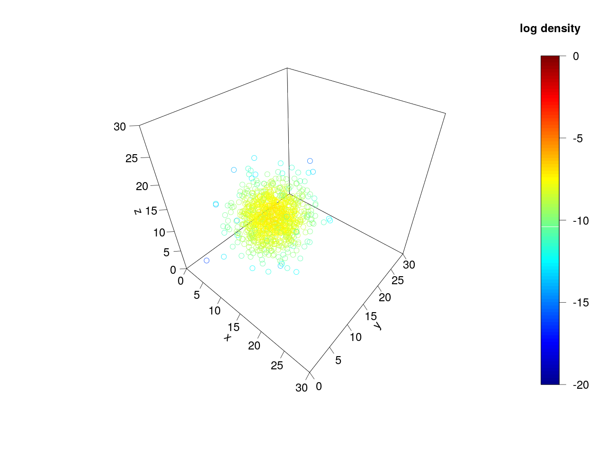
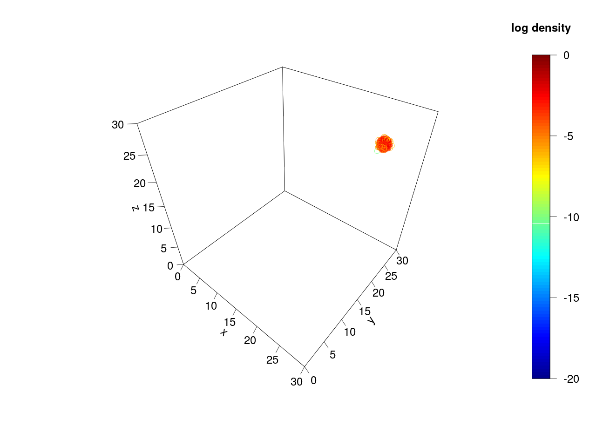

# Assessing MCMC convergence

## Introduction

Consider the following MCMC traces showing the log probability density from two
independent chains, both sampling from the same probability distribution:

Which chain has converged? It seems intuitive that the chain with the higher
log probability density has converged and is sampling from the stationary
distribution, whereas the chain with the lower posterior density has failed to
do so. After all, there is roughly 6.5 log units between the means of the two
chains, meaning that the probability density being sampled by the turquoise
chain is over 600 times greater than what is being sampled by the gold
chain!

However I will show that in fact neither chain has converged.

## Probability distribution parameters

In this case, we are sampling from a three-dimensional probability
distribution which is a 50/50 mixture of two circularly symmetric multivariate
Gaussians. The mean and standard deviation of each coordinate for the first
(large) Gaussian are 12 and 3 respectively, and for the second (small)
Gaussian they are 25 and 1/3.

Because the Gaussians are placed some distance apart, this creates two modes
which divide the probability mass of the mixture. As we made the split 50/50,
if the probability distribution happens to be a posterior distribution, we are
~50% certain that the truth lies within the larger mode, and ~50% certain that
it lies within the smaller mode.

Using the `random_samples.R` script I drew 1000 independent samples from this
mixture, so you can see the two modes:

What has occured above is that the turquoise chain is only exploring the
small mode, and the gold chain is only exploring the large mode. Because the
probability mass of each mode is roughly equal, the smaller mode *must* have
a higher probability density, as mass divided by volume equals density!

## MCMC sampling

The turquoise and gold traces were generated using a simple MCMC algorithm
implemented in `mcmc_demo.py`. This script is called as `mcmc_demo.py <filename>`
where the filename to log the trace is the first argument. The algorithm
works as follows:

  1. Pick an initial set of coordinates (*x*, *y*, *z*) nearby the small mode
  2. Calculate the probability density *p* of the initial coordinates
  3. Propose changing one coordinate by delta ~ Normal(0, 3)
  4. Calculate the probability density *p'* of the proposed coordinates
  5. Calculate the acceptance probability *A* = max(1, *p'* / *p*)
  6. With probability *A*, replace *p* and (*x*, *y*, *z*) with *p'* and the proposed coordinates
  7. Go to 3 until a stopping condition is met

The log probability density and coordinates are recorded for every 100th
iteration, and chains are run for 100,000 iterations, for a total of 1,000
samples.

I ran ten of these chains, each given a filename of the pattern
`demo_trace_N.tsv`. For each trace I ran the script `plot_trace.R` with is
called like `plot_trace.R demo_trace_N`. This script reads in a trace file and
outputs a plot of the MCMC samples with their log probability densities
as a png. Four of the chains, e.g. `demo_trace_0`, only explored the large
mode:

While six of the chains, e.g. `demo_trace_1`, only explored the small mode:

The standard deviation of the log probability was approximately 1.2 for all
chains. Since the difference in means was roughly 6.5 log units, the log
probabilities of chains in the large mode were roughly 5.4 standard deviations
separated from chains in the small mode.

## Increasing dimensionality

Bayesian multispecies coalescent (MSC) and multispecies network coalescent
(MSNC) methods are used to infer thousands or even more parameters in a given
analysis. For example, given a 101 taxon species tree, 99 gene trees, and one
allele sampled per locus per species, there will be 100 internal nodes for each
of the 100 trees - this means 10,000 node heights must be estimated! Then we must
consider all the other parameters like population sizes, tree topologies,
substitution model parameters and so on.

However so far we have only been inferring three parameters. What happens if
we increase the number of parameters, but leave everything else the same? I
tweaked the implementation to estimate five parameters, and this script has
the filename `mcmc_5.py`. The filenames of the traces are of the pattern
`demo5_trace_N.tsv`. Opening these in [Tracer](http://beast.community/tracer)
revealed a trend similar to the three parameter case:

With the green and red chains exploring the smaller and larger modes
respectively... however the differences are more extreme. The standard
deviation for the log probability was approximately 1.6 for all chains, but
the difference in means was roughly 11 log units. This means that the log
probabilities of the chains in the large mode were almost 7 standard
deviations separated from chains in the small mode! That's 1000 times less
probability density! Clearly as we increase the dimensionality, this pathology
only gets worse.

## Achieving convergence

The two most obvious ways to overcome this pathology when using MCMC for a
Bayesian phylogenetic analysis are:

1. Reduce the size of the dataset to smooth out the posterior distribution
2. Improve the MCMC algorithm so it can switch between modes

The first suggestion disappoints users, and the second suggestion requires
developers to invest a lot of time they may not have. However for my toy
example we can fairly easily improve it by changing the proposal in step 3 of
the algorithm.

Rather than changing a single coordinate, we change a random subset of the
coordinates all by the same delta. For example in the three taxon case, we
might change *x* alone, or *y* and *z* together, or *x*, *y* and *z*
simultaneously. Also, we double the standard deviation of the proposal
distribution used to generate delta from 3 to 6. To run the improved method,
call the MCMC script with the arguments `mcmc_demo.py 2 <filename>`.

Using the improved algorithm, every chain was able to switch between modes.
ESS values for individual chains were all below 100, but by concatenating
the traces of ten chains we can reach ESS values above 200:

This improved algorithm was not able to switch between modes when used with
five parameters, This is not surprising as convergence gets harder to achieve
with more dimensions, illustrating the difficulty faced by developers of very
highly dimensional phylogenetic methods.

## Final note

Left as an exercise for the reader is to consider what this means for the
validity of using the maximum *a posteriori* sample, maximum likelihood
results... or indeed any point estimate.
